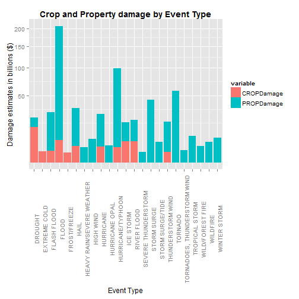
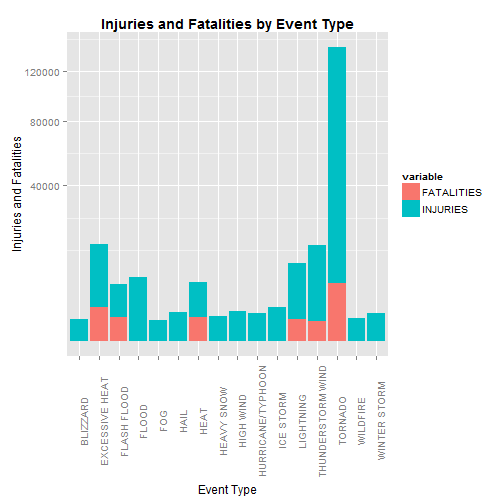

## Synopsis
The National Oceanic and Atmospheric Administration maintain a storm database, which collects a range of data describing the impact from different types of natural events. This analysis reviews both the financial and human impact attributed to different event type. 

The data suggests large proportions of the financial and human impact from natural events are the result of a disproportionately small number of event types. The leading contributors to financial damage are Floods, hurricanes/typhoons and tornadoes account. While the single largest cause of injuries and fatalities are tornadoes.


## Data Processing
### Load required Librarys

The following librarys are used to analysis the data and produce this report. Hence, they must be loaded first.


```r
library(ggplot2)
library(dplyr)
library(reshape2)
```

### Load storm data into R

Load the National Oceanic and Atmospheric Administration's (NOAA) storm data into R. The data are stored in a comma separated  value format, which is compressed with bz2. 

All data are first read into a dataframe. The dataframe size is reduced by selecting only the columns required for the analysis. The dataframe size is further reduced by filtering rows containing all zero values (i.e. no fatality, injury, or damage values). 


```r
fileHandle <- "repdata-data-StormData.csv.bz2"
stormData <-read.csv(bzfile(fileHandle))

# Reduce dataframe by selection only required follows and rows with non-zero values
columnsRequired <- c("EVTYPE", "FATALITIES", "INJURIES", "PROPDMG", "PROPDMGEXP", "CROPDMG", "CROPDMGEXP")
rowsRequired <- stormData$PROPDMG != 0 | stormData$CROPDMG != 0 | stormData$FATALITIES != 0 | stormData$INJURIES != 0

stormData <- subset(stormData, rowsRequired, select=columnsRequired)
```

### Clean Event Type data

The event type data are maintained in the EVTYPE column. The EVTYPE data contains a significant number of descriptions where different case was used. In addition, many similar event type descriptions are in the data. For example, hail is reported as 'HAIL 125', 'HAIL 150', 'HAIL 175', etc. 

Event type data was homogenized to ensure significant of observations are not defused across a large number related categories. CAUTION: Subjective judgement was exercised to determine the level of similarity. For example, are 'flash floods' significantly different to a 'flood'?


The Top 10 event types BEFORE cleaning the EVTYPE descriptions are:


```r
sort(table(stormData$EVTYPE),decreasing = TRUE)[1:10]
```

```
## 
##          TSTM WIND  THUNDERSTORM WIND            TORNADO 
##              63234              43655              39944 
##               HAIL        FLASH FLOOD          LIGHTNING 
##              26130              20967              13293 
## THUNDERSTORM WINDS              FLOOD          HIGH WIND 
##              12086              10175               5522 
##        STRONG WIND 
##               3370
```

And the initial number of factor levels in EVTYPE are:


```r
# Number of factor levels BEFORE cleaning data
length(levels(stormData$EVTYPE))
```

```
## [1] 985
```

The first step of cleaning the EVTYPE data was to convert all characters to UPPERCASE. The level of factors was reduced from 985 to 447 in this step.

#### Converting to UPPERCASE
Converting all EVTYPE descriptions in UPPERCASE reduced the number of factor levels to:


```r
# Convert all EVTYPE value to UPPERCASE. This step reduces the EVTYPE factors by 
stormData$EVTYPE <- as.factor(toupper(stormData$EVTYPE))
length(levels(stormData$EVTYPE))
```

```
## [1] 447
```

#### Further Grouping

Further reduction was achieved through a limited number of character substitutions. An 80/20 approach was employed to apply the remaining groupings. The focus was on grouping variants that might affect the final Top 10 event type by occurrence.


```r
# Remove leading whitespace
stormData$EVTYPE <- as.factor(sub(pattern = "^[ \t]+", replacement = "",stormData$EVTYPE))

# Further reduce namespace
stormData$EVTYPE <- as.factor(sub(pattern = "TSTM WIND.*", replacement = "THUNDERSTORM WIND",stormData$EVTYPE))
stormData$EVTYPE <- as.factor(sub(pattern = "THUNDERSTORM WIND.*", replacement = "THUNDERSTORM WIND",stormData$EVTYPE))
stormData$EVTYPE <- as.factor(sub(pattern = "HAIL .*", replacement = "HAIL",stormData$EVTYPE))
stormData$EVTYPE <- as.factor(sub(pattern = "TORNADO .*", replacement = "TORNADO",stormData$EVTYPE))
stormData$EVTYPE <- as.factor(sub(pattern = "HIGH WIND.*", replacement = "HIGH WIND",stormData$EVTYPE))
```

The Top 10 event types AFTER cleaning the EVTYPE descriptions are:


```r
sort(table(stormData$EVTYPE),decreasing = TRUE)[1:10]
```

```
## 
## THUNDERSTORM WIND           TORNADO              HAIL       FLASH FLOOD 
##            119615             39957             26144             20968 
##         LIGHTNING             FLOOD         HIGH WIND       STRONG WIND 
##             13293             10175              6200              3372 
##      WINTER STORM        HEAVY SNOW 
##              1508              1342
```

As a result, the number of factor levels AFTER cleaning the EVTYPE data are:


```r
length(levels(stormData$EVTYPE))
```

```
## [1] 367
```


### Calculate Property and Crop damage cost

The property and crop damage data are each recorded in two component values. The first component records the damage estimate rounded to 3 significant digits and the second component reports the magnitude of the estimate. The magnitude describes the number of 0s behind the estimate. For example, a damage estimate of 7.23 with magnitude 4 equates to $72300.

The magnitude data contains character data in addition to numerical values. These character values denote shorthand values for common magnitudes (e.g. k = 1,000, m = 1,000,000, etc.). Therefore, in order to create a single column for each type of damage estimate (i.e. crop and property), the characters values must be replaces.

#### Property Damage
The initial values for the property damage magnitude BEFORE cleaning data are:


```r
table(stormData$PROPDMGEXP)
```

```
## 
##             -      ?      +      0      1      2      3      4      5 
##  11585      1      0      5    210      0      1      1      4     18 
##      6      7      8      B      h      H      K      m      M 
##      3      3      0     40      1      6 231428      7  11320
```

The follow substitutions are applied to the property damage magnitude data


```r
stormData$PROPDMGEXP <- sub(pattern = "h", replacement = "2",stormData$PROPDMGEXP , ignore.case = TRUE)
stormData$PROPDMGEXP <- sub(pattern = "k", replacement = "3",stormData$PROPDMGEXP , ignore.case = TRUE)
stormData$PROPDMGEXP <- sub(pattern = "m", replacement = "6",stormData$PROPDMGEXP , ignore.case = TRUE)
stormData$PROPDMGEXP <- sub(pattern = "b", replacement = "9",stormData$PROPDMGEXP , ignore.case = TRUE)
stormData$PROPDMGEXP <- sub(pattern = "[^1-9]", replacement = "0",stormData$PROPDMGEXP)
stormData$PROPDMGEXP <- sub(pattern = "[?]", replacement = "0",stormData$PROPDMGEXP)
stormData$PROPDMGEXP <- as.numeric(stormData$PROPDMGEXP)
```

The resultant property damage magnitude data AFTER cleaning are:


```r
table(stormData$PROPDMGEXP)
```

```
## 
##      0      2      3      4      5      6      7      9 
##    216      8 231429      4     18  11330      3     40
```

Final step is to calculate the new measure PROPDamage, which is the combination of the PROPDMG and PROPDMGEXP data.


```r
stormData$PROPDamage <- stormData$PROPDMG * (10 ^ stormData$PROPDMGEXP)
```

#### Crop Damage
The initial values for the crop damage magnitude BEFORE cleaning data are:


```r
table(stormData$CROPDMGEXP)
```

```
## 
##             ?      0      2      B      k      K      m      M 
## 152664      6     17      0      7     21  99932      1   1985
```

The follow substitutions are applied to the crop damage magnitude data


```r
stormData$CROPDMGEXP <- sub(pattern = "h", replacement = "2",stormData$CROPDMGEXP , ignore.case = TRUE)
stormData$CROPDMGEXP <- sub(pattern = "k", replacement = "3",stormData$CROPDMGEXP , ignore.case = TRUE)
stormData$CROPDMGEXP <- sub(pattern = "m", replacement = "6",stormData$CROPDMGEXP , ignore.case = TRUE)
stormData$CROPDMGEXP <- sub(pattern = "b", replacement = "9",stormData$CROPDMGEXP , ignore.case = TRUE)
stormData$CROPDMGEXP <- sub(pattern = "[^1-9]", replacement = "0",stormData$CROPDMGEXP , ignore.case = TRUE)
stormData$CROPDMGEXP <- sub(pattern = "[?]", replacement = "0",stormData$CROPDMGEXP , ignore.case = TRUE)
stormData$CROPDMGEXP <- as.numeric(stormData$CROPDMGEXP)
```

The resultant crop damage magnitude data AFTER cleaning are:


```r
table(stormData$CROPDMGEXP)
```

```
## 
##     0     3     6     9 
##    23 99953  1986     7
```

Final step is to calculate the new measure PROPDamage, which is the combination of the PROPDMG and PROPDMGEXP data.


```r
stormData$CROPDamage <- stormData$CROPDMG * (10 ^ stormData$CROPDMGEXP)
```

## Results
### Analysis of Financal Impact

In the dataset, crop and property values are maintained in unrelated columns. The damage estimates in these fields need to be merge, so that the total financial impact of each event type can be assessed. However, it is useful to maintain which measure the merged values is derived from. The *melt()* function reshape2 package is extremely useful for this purpose.


```r
damageData <- melt(data = stormData, id.vars = c("EVTYPE"), measure.vars = c("CROPDamage", "PROPDamage"), na.rm = TRUE)
```

Next the damage data are aggregated to the sum of all damage estimates versus event type and the estimate source (i.e. crop and property). 


```r
totalDamageData <- aggregate(value ~ EVTYPE + variable, data=damageData, FUN = sum)
```

A review of the damage estimate data notes a mean of:


```r
mean(totalDamageData$value)
```

```
## [1] 1092286179
```

The damage estimate data mean is used to select a minimum level significance for the data. The mean value is rounded down and only events resulting in damages of greater than $1,000,000,000 are maintained for further analysis.


```r
# Mean is 1,092,286,179
totalDamageData <- filter(totalDamageData, value > 1e9)
```

The resultant event types where either crop or property damage greater than 1 billion dollars are:


```r
arrange(totalDamageData, desc(value))
```

```
##                          EVTYPE   variable        value
## 1                         FLOOD PROPDamage 144657709800
## 2             HURRICANE/TYPHOON PROPDamage  69305840000
## 3                       TORNADO PROPDamage  56952151874
## 4                   STORM SURGE PROPDamage  43323536000
## 5                   FLASH FLOOD PROPDamage  16822723772
## 6                          HAIL PROPDamage  15735969456
## 7                       DROUGHT CROPDamage  13972566000
## 8                     HURRICANE PROPDamage  11868319010
## 9             THUNDERSTORM WIND PROPDamage   9969148473
## 10               TROPICAL STORM PROPDamage   7703890550
## 11                 WINTER STORM PROPDamage   6688497251
## 12                    HIGH WIND PROPDamage   6003353040
## 13                        FLOOD CROPDamage   5661968450
## 14                  RIVER FLOOD PROPDamage   5118945500
## 15                  RIVER FLOOD CROPDamage   5029459000
## 16                    ICE STORM CROPDamage   5022113500
## 17                     WILDFIRE PROPDamage   4765114000
## 18             STORM SURGE/TIDE PROPDamage   4641188000
## 19                    ICE STORM PROPDamage   3944927860
## 20               HURRICANE OPAL PROPDamage   3172846000
## 21                         HAIL CROPDamage   3026044470
## 22             WILD/FOREST FIRE PROPDamage   3001829500
## 23                    HURRICANE CROPDamage   2741910000
## 24            HURRICANE/TYPHOON CROPDamage   2607872800
## 25    HEAVY RAIN/SEVERE WEATHER PROPDamage   2500000000
## 26 TORNADOES, THUNDERSTORM WIND PROPDamage   1600000000
## 27                  FLASH FLOOD CROPDamage   1421317100
## 28                 EXTREME COLD CROPDamage   1312973000
## 29            THUNDERSTORM WIND CROPDamage   1224397980
## 30          SEVERE THUNDERSTORM PROPDamage   1205360000
## 31                 FROST/FREEZE CROPDamage   1094186000
## 32                      DROUGHT PROPDamage   1046106000
```

The damage estimates for crop and property are illustrated on the below chart. It is evident from the chart that:

1. The financial impact from property damage is higher than crops damage
2. 'Flood' events have the highest financial impact of all event types
3. 'Flood' events caused approximately $144 billion of property damage, which is the largest contributor to property damage. The next highest event type is 'HURRICANE/TYPHOON' at $69 billion.
4. 'Drought' is the largest contributor to crop damage at almost $14 billion. This is more than twice the estimated damage to crops than from 'Flood' at $5.6 billion.

IMPORTANT NOTE: The y-axis does not use a linear scale. A SQRT transformation is used to improve readability.


```r
figure1 <- ggplot(totalDamageData, aes(x=EVTYPE, y=value/1e9, fill=variable)) + 
    geom_bar(stat="identity") +
    theme(axis.text.x = element_text(angle=90), plot.title = element_text(face="bold")) +
    scale_x_discrete(name="Event Type") +
    scale_y_sqrt(name = "Damage estimates in billions ($)") +
    ggtitle("Crop and Property damage by Event Type")

figure1
```

 


### Calculate Human total
Similar to the financial impact analysis, fatality and injury values are maintained in unrelated columns. As before, these data are merged to support the assessment of total human impact from each event type.


```r
humanData <- melt(data = stormData, id.vars = c("EVTYPE"), measure.vars = c("FATALITIES", "INJURIES"), na.rm = TRUE)
```

Next the human impact data are aggregated to sum all fatalities and injuries versus event type and the estimate source (i.e. crop and property). 

An additional step is used for the human impact analysis. All zero values are filtered from the dataset before the mean is calculated. A much larger property of the human impact data has zero values than the damage data. Filtering the zero data results in a larger mean. However, this does not change the outcome of the analysis. The mean simply informs the decision to where the minimum threshold for reporting in our data.


```r
totalHumanData <- aggregate(value ~ EVTYPE + variable, data=humanData, FUN = sum)
totalHumanData <- filter(totalHumanData, value > 0) 
```

A review of the human impact data notes a mean of:


```r
mean(totalHumanData$value)
```

```
## [1] 552.0319
```

The human impact data mean is used to select a minimum level significance for the data. The mean value is rounded and only events resulting in more than 550 fatalities or injuries are maintained for further analysis.


```r
# Mean is 1,092,286,179
totalHumanData <- filter(totalHumanData, value > 550) 
```

The resultant event types where either fatalities or injuries are greater than 550 are:


```r
arrange(totalHumanData, desc(value))
```

```
##               EVTYPE   variable value
## 1            TORNADO   INJURIES 91364
## 2  THUNDERSTORM WIND   INJURIES  9458
## 3              FLOOD   INJURIES  6789
## 4     EXCESSIVE HEAT   INJURIES  6525
## 5            TORNADO FATALITIES  5633
## 6          LIGHTNING   INJURIES  5230
## 7               HEAT   INJURIES  2100
## 8          ICE STORM   INJURIES  1975
## 9     EXCESSIVE HEAT FATALITIES  1903
## 10       FLASH FLOOD   INJURIES  1777
## 11         HIGH WIND   INJURIES  1471
## 12              HAIL   INJURIES  1361
## 13      WINTER STORM   INJURIES  1321
## 14 HURRICANE/TYPHOON   INJURIES  1275
## 15        HEAVY SNOW   INJURIES  1021
## 16       FLASH FLOOD FATALITIES   978
## 17              HEAT FATALITIES   937
## 18          WILDFIRE   INJURIES   911
## 19         LIGHTNING FATALITIES   816
## 20          BLIZZARD   INJURIES   805
## 21               FOG   INJURIES   734
## 22 THUNDERSTORM WIND FATALITIES   709
```

The fatality and injury impacts are illustrated on the below chart. It is evident from the chart that:

1. Injuries occur more often than fatalities
2. 'Tornado' events are the leading cause of injuries and fatalities. 
3. Injuries attributed to 'Tornado' are almost 10 times greater than the second largest category 'Thunderstorm Wind' 

IMPORTANT NOTE: The y-axis does not use a linear scale. A SQRT transformation is used to improve readability.


```r
figure2 <- ggplot(totalHumanData, aes(x=EVTYPE, y=value, fill=variable)) + 
    geom_bar(stat="identity") +
    theme(axis.text.x = element_text(angle=90), plot.title = element_text(face="bold")) +
    scale_x_discrete(name="Event Type") +
    scale_y_sqrt(name = "Injuries and Fatalities") +
    #scale_y_continuous(name = "Injuries and Fatalities") +
    ggtitle("Injuries and Fatalities by Event Type")

figure2
```

 


